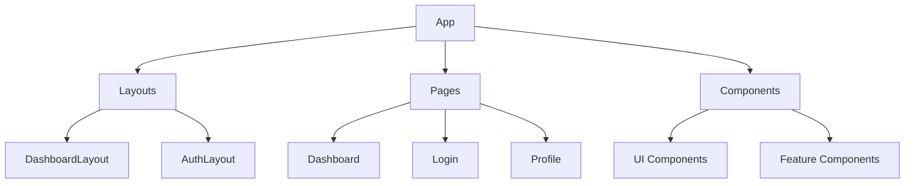

<div align="center">

# 🎓 Senati-Sinfo Redesign 🎓


</div>

<div align="center">
<a href="https://sakuwar.github.io/Senati-Sinfo/" target="_blank">Solo deseas ver la web?, entra aqui!!!</a>
</div>

## 📋 Descripción 

**Propuesta de rediseño conceptual** del Sistema de Información Estudiantil (SINFO) de SENATI, enfocado en:

- 🚀 **Mejorar la experiencia de usuario** con un diseño moderno e intuitivo  
- 💡 **Optimizar flujos académicos** clave para estudiantes técnicos  
- 🎨 **Renovar la interfaz visual** manteniendo la identidad institucional  
- 📱 **Garantizar responsividad** total para acceso móvil  

> *Nota: Proyecto académico demostrativo, no afiliado oficialmente a SENATI.*

<div align="center">
  
</div>

## 🔝 Principales mejoras propuestas 

<table>
  <thead>
    <tr>
      <th align="center">Sistema Actual</th>
      <th align="center">Rediseño Propuesto</th>
    </tr>
  </thead>
  <tbody>
    <tr>
      <td align="center">⚠️ Interfaz obsoleta</td>
      <td align="center">✨ Diseño moderno con dark mode</td>
    </tr>
    <tr>
      <td align="center">🔄 Navegación compleja</td>
      <td align="center">🎯 Acceso rápido con tarjetas interactivas</td>
    </tr>
    <tr>
      <td align="center">📊 Visualización estática</td>
      <td align="center">📈 Datos dinámicos con gráficos y filtros</td>
    </tr>
    <tr>
      <td align="center">💻 Limitado a desktop</td>
      <td align="center">📱 Experiencia mobile-first</td>
    </tr>
  </tbody>
</table>

## ⚙️ Instalación 
1. Instalalar <a href="https://nodejs.org/es" target="_blank">Node.js</a>

2. Clonar repositorio:
```bash
git clone https://github.com/SakuWar/Senati-Sinfo.git
cd Senati-Sinfo
```

3. Instalar dependencias:
```bash
npm install
# o
yarn install
```

4. Iniciar servidor de desarrollo:
```bash
npm run dev
# o
yarn dev
```

5. Abrir en navegador:
```bash
http://localhost:5173
```

## 🛠️ Tecnologías 

<div align="center">
  
  
  
  
  
</div>

* **React 18** + TypeScript
* **Tailwind CSS** con modo oscuro
* **Vite** como bundler
* **Lucide-react** para iconografía
* **React Router** (si se implementa navegación avanzada)
* **ESLint** + **Prettier** para calidad de código

## 🖱️ Instrucciones de uso 

### Navegación principal

* **Acceso Rápido**: Botones principales en la parte superior
   * 📅 **Horario**: Muestra calendario semanal
   * 🎓 **Notas**: Listado de calificaciones
   * 💰 **Pagos**: Estado de obligaciones económicas
   * 📚 **Cursos**: Detalle de materias matriculadas

### Panel de Servicios

* **Tarjetas interactivas**: Click para expandir/colapsar
* **Hover effects**: Efectos visuales al pasar el mouse
* **Búsqueda**: Campo superior derecho (implementación futura)

### Funcionalidades clave

1. **Modo oscuro**: Botón de luna/sol en header
2. **Responsive design**: Adaptable a móviles (menú hamburguesa)
3. **Filtrado de datos**: Implementar en próximas versiones
4. **Exportar datos**: Opción en desarrollo para PDF/Excel

## 🤝 Cómo colaborar 

### Guía de contribución

1. Crear un fork del repositorio
2. Sigue el flujo de trabajo Git Flow
3. Usa convención de commits:
```bash
feat: Nueva funcionalidad de horarios
fix: Corrección en cálculo de promedios
docs: Actualización de README
```

### Estilo de código

* **Componentes**: PascalCase (Ej: `StudentDashboard.tsx`)
* **Variables**: camelCase
* **Tailwind**: Ordenar clases usando Headwind
* **TypeScript**: Tipado estricto obligatorio

### Issues

1. Revisar issues existentes antes de crear uno nuevo
2. Usar etiquetas adecuadas (bug, enhancement, documentation)
3. Para features complejas, crear una propuesta primero

<div align="center">
  
## 📊 Arquitectura del proyecto


</div>

---

<div align="center">
  
✨ **¡Tu contribución es bienvenida!** ✨

<a href="https://github.com/SakuWar/Senati-Sinfo/issues">
  
</a>
<a href="https://github.com/SakuWar/Senati-Sinfo/pulls">
  
</a>

</div>

<div align="center">
  <sub>Hecho con ❤️ por estudiantes para estudiantes</sub>
</div>
